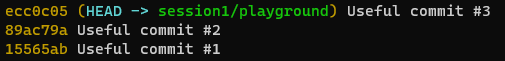
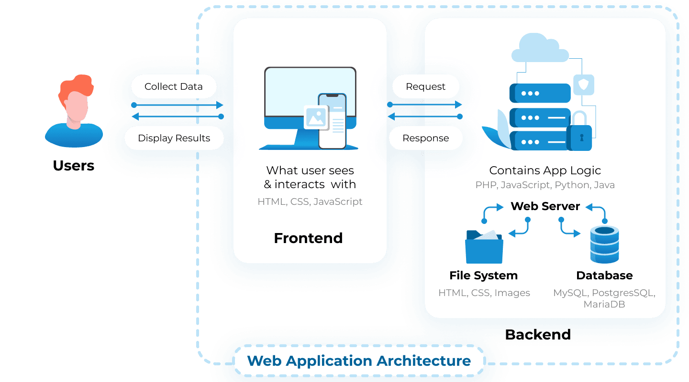
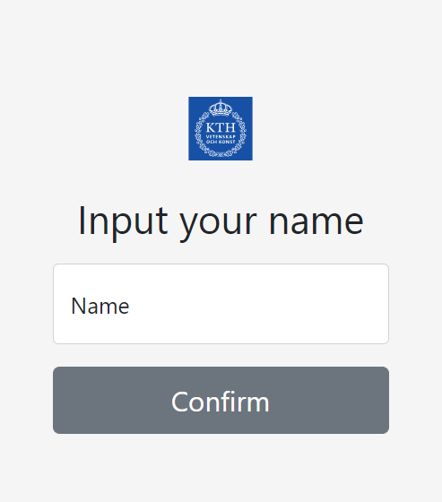

# **Web Development**

Session 1 - Quick Start

*[BY GDSC@KTH](https://gdsc.community.dev/kth-royal-institute-of-technology/)*

Zezhe Huang

<!-- _footer: "Powered by Marp for VS Code" -->

---

## **Event Info**

- [Four sessions](https://gdsc.community.dev/events/details/developer-student-clubs-kth-royal-institute-of-technology-presents-hands-on-web-development-series/)
  - quick-start, backend, frontend, practice
- Fullstack
  - separation of frontend and backend
- Targeted for
  - intermediate programmers
  - beginners in web development

---

### Possible Sessions with Specific Topics

- Flutter by Thameez
- Firebase
- **Call for more sessions**

<!-- _header: "Event Info" -->

---

### What/How You Will Learn

- Start to develop your own web applications
  - Portfolio, blog, gallery, todo list...
- Avoid to be wordy and theoretic
- Really **hands-on**
- Django, React, PostgreSQL, MUI, ...

<!-- _header: "Event Info" -->

---

### Outline for Today

*Introduction to what you'd better know; prepare yourself before something more practical comes in*

- Git
- Web Application Architecture
- Basics of Frontend
- Basics of Backend

<!-- _header: "Event Info" -->

---

## **Get Started with Git**

- Install Git if you haven't: https://git-scm.com/
- Check out our repository: [web-dev-sessions](https://github.com/GDSC-KTH/web-dev-sessions)

---

### How many git commands you've used

https://www.menti.com/65j3f6ph9q


<!-- Result: https://www.mentimeter.com/s/22173a67c6cd8e3c44235af3a921921b/2b55029eef3f -->

<!-- _header: "Get Started with Git" -->

---

**Follow the steps to warm up!**

If it's your first time to use git

```sh
git config --global core.name "YOUR NAME"
git config --global core.email "YOUR@EMAIL.com"
```

Then choose your working directory `cd MY_DIR`

```sh
git clone git@github.com:GDSC-KTH/web-dev-series.git
cd web-dev-series
git switch session1/playground
git log --oneline
```

<!-- _header: "Get Started with Git" -->

---

**Clean up commits history!**

1. Check out commits of branches `session1/playground1` and `session1/playground2`
2. Organnize commits in order and eliminate DUMMY commits and TRASH files

<!-- _header: "Get Started with Git" -->

---

### Final results





<!-- _header: "Get Started with Git" -->

---

## **Architecture**



<!-- _footer: "https://litslink.com/blog/web-application-architecture" -->

---

### Fine-grained


<!-- _header: "Architecture" -->
<!-- _footer: "https://litslink.com/blog/web-application-architecture" -->

---

## **Create a Static Page**

What you probably already know

```html
<html>
  <body>
    <div style="height:100%;display:flex;">
      <h1 style="margin:auto;text-align:center;width:100%;" id="content">
      </h1>
    </div>
    <script>
        document.getElementById("content").innerHTML="Hello, World!";
    </script>
  </body>
</html>
```

---

Check out the [bootstrap example](https://getbootstrap.com/docs/5.1/examples/sign-in/), and redesign it



<!-- _header: "Create a Static Page" -->


---

## **Create a Simple Server**

**How Frontend and Backend Communicate**

Mostly we use **HTTP APIs**

**How a Persistent Server Handles API Requests**
You might hear about
- Django
- Flask
- FastAPI

Here we use **Flask** as an example.

---

1. `pip install flask flask-cors`

2. Save as `app.py`:

```python
from flask import Flask
from flask_cors import CORS

app = Flask(__name__)
CORS(app)

@app.route("/<name>")
def hello_world(name):
    return {"name": name, "length": len(name)}

if __name__ == "__main__":
    app.run(debug=True)
```

3. Run it by `python app.py`

<!-- _header: "Create a Simple Server" -->

---

### **Request API from Frontend**

1. Inject the script for HTTP requests
  `<script src="https://unpkg.com/axios/dist/axios.min.js"></script>
`
1. Request API and replace html content by response
   ```javascript
   axios.get(`http://127.0.0.1:5000/${name}`)
    .then(function (response) {
        const len = response.data.length;
        document.getElementById("content1")
            .innerHTML = `Hello, ${name}!`;
        document.getElementById("content2")
            .innerHTML = `The length of your name is: ${len}.`
    });
   ```

<!-- _header: "Create a Simple Server" -->

---


<!-- _header: "Create a Simple Server" -->

---

## **More to Think About**

- Data storage
- Security
- Hosting
- ...

---

## **Prepare for Next Session**

- Install PostgreSQL (involved in installation of django)
  - Better in docker
- Install Python libraries
  - [django](https://docs.djangoproject.com/en/3.2/intro/install/)
  - [django-rest-framework](https://www.django-rest-framework.org/#installation)

---

### Useful Links

- Repository for this session
  - https://github.com/GDSC-KTH/web-dev-series
- Explore more about Git
  - https://learngitbranching.js.org/
  - https://gitimmersion.com/index.html