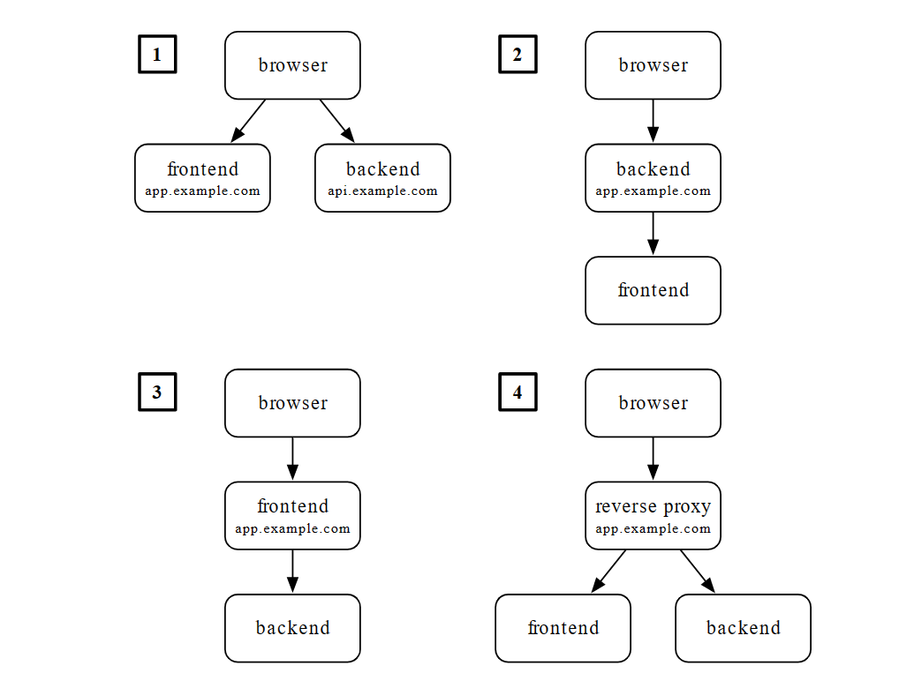

# **Web Development**

Session 3 - Frontend

_[BY GDSC@KTH](https://gdsc.community.dev/kth-royal-institute-of-technology/)_

Thameez Bodhanya

<!-- _footer: "Powered by Marp for VS Code" -->

---

## What Can Be Expected Today?

- Learn the basics of working with:
  - Javascript
  - NodeJS
  - Yarn
  - ReactJS

---

## Prerequisites

- Project [repository](https://github.com/GDSC-KTH/web-dev-series) already cloned and `session-3` branch checked-out and you are in the `session-3` folder.
- `docker` and `docker-compose` installed on your system (checkout [README.md](./README.md) for instructions)
- If not using docker-compose for the frontend component
  - `NodeJS` must be installed on your system -> [NodeJS download](https://nodejs.org/en/download/)
  - `yarn` must be installed on your system -> `npm install -g yarn`

---

## Disclaimer

There is a lot to learn and discover for each of the technologies being discussed today. On each slide you will find various links to documentation that can help you find your feet with the relevant technology.
I have also attempted to be quite granular with the git commits, therefore feel free to go through the branch commit by commit to see how the pieces fit together.

---

## Javascript

JavaScript is a powerful programming language that can add interactivity to a website

- Not related to Java :)
- Primarily used for dynamic client-side scripts, however can be used server-side (such as Node.js)
- In modern web-development, we generally use a [Framework](https://skillcrush.com/blog/what-is-a-javascript-framework/) when working with Javascript
  - In our case we will be using [React](https://reactjs.org/)
    - Technically a Library

<!-- _footer: "https://developer.mozilla.org/en-US/docs/Learn/Getting_started_with_the_web/JavaScript_basics" -->

---

## NodeJS

[Node.js](https://nodejs.org/en/) is a platform built on Chrome's JavaScript runtime for easily building fast and scalable network applications. Node.js uses an event-driven, non-blocking I/O model that makes it lightweight and efficient, perfect for data-intensive real-time applications that run across distributed devices.

_TLDR: Lets use use JavaScript to run server-side code._

<!-- _footer: "https://www.tutorialspoint.com/nodejs/nodejs_introduction.htm" -->

---

## Yarn

An advantage of JS and Node is the millions of Libraries which exist and using a `package-manager` has a few advantages

- It is used to download code packages for your apps. These packages are standalone tools that you can use right away within your projects.
- You can manage multiple versions of packages and dependencies.
- You can update your applications easily when the underlying package is updated.

[Yarn](https://yarnpkg.com/) is a package-manager which doubles as a project-manager.

<!-- _footer: "https://www.section.io/engineering-education/npm-vs-yarn-which-one-to-choose/" -->

---

## ReactJS

- [ReactJS](https://reactjs.org/) is a JS Library used for building user interfaces.
- React is a declarative, efficient, and flexible JavaScript library for building user interfaces. It lets you compose complex UIs from small and isolated pieces of code called “components”.
- Uses a syntax called [jsx](https://reactjs.org/docs/introducing-jsx.html)

<!-- _footer: "https://reactjs.org/tutorial/tutorial.html" -->

---

## Architectures

There are various design architectures which can be used to run a django backend with a JS frontend, each with their own pros and cons.

---

<!-- _footer: https://fractalideas.com/blog/making-react-and-django-play-well-together/ -->

---

- We shall be using design architecture 1, or a `Single Page App` model which provides several benefits; primarily flexibility.
  - In this design, the frontend serves the same empty HTML page at every URL. This page:
    - loads a JavaScript app which renders the contents of the page
    - handles navigation
    - and makes API requests to the backend running on another domain.

<!-- _footer: "https://fractalideas.com/blog/making-react-and-django-play-well-together-single-page-app-model/" -->

---

## Getting Started

To begin, we will use [create-react-app](https://create-react-app.dev/) which will automate the creation and bootstrapping of a NodeJS ReactJS Javascript app for us

- `yarn create react-app myblog`
  - This command bootstraps a ReactJS app called myblog in the current directory
  - In our case, since we are using docker-compose the following command will need to be run
    - `docker-compose run frontend yarn create react-app myblog`

Checkout git commit-hash `749a0640b66af2a6a213e2444ba924a113d44196`

---

## Adding Packages

`yarn` uses the following syntax to install packages:

- `yarn add PACKAGE_NAME`

As an example, we require `react-router-dom` package and so we run:

- `yarn add react-router-dom` or
- `docker-compose run frontend yarn add react-router-dom`

---

## App.jsx

This file contains the root of the Javascript app that will be served when our page is accessed.

Code can be found at `frontend/src/App.jsx` at githash `1015adcc7c8b99c78c809f60dee50c81aa678341`

---

## Adding Components

---

### Login

This creates our Login form, it takes in a username and password and makes a call to the backend to authenticate.
If successful a JWT is returned and stored.

Code can be found at `frontend/src/components/Login` at githash `e4a065d1397d91169c5c758b134c15eba7b77457`.

<!-- _footer: "https://www.digitalocean.com/community/tutorials/how-to-add-login-authentication-to-react-applications" -->

---

### NavBar

This creates a standard Navigation Bar which allows us to quickly navigate to other routes in our app.

Code can be found at `frontend/src/components/NavBar.jsx` at githash `590736258fef7ca5167d44e38a0cda5c22f9579f`.

<!-- _footer: "Components influenced by https://javascript.plainenglish.io/build-a-blog-app-with-react-finish-the-project-3f4bc4f24ece" -->

---

### Home

This creates our 'Home' page. It first makes a call to the backend to retrieve all blog posts.
Once received without error, we display the list of blogs linking to each via the `BlogList` component

Code can be found at `frontend/src/components/Home` at githash `0a332a3901b3e41b80d983a8ceaa500b31fbd41d`.

<!-- _footer: "Components influenced by https://javascript.plainenglish.io/build-a-blog-app-with-react-finish-the-project-3f4bc4f24ece" -->

---

### Create Blog

This creates a form which allows us to create a blog. It takes in the required fields and makes a call to the backend to add the blog.

Code can be found at `frontend/src/components/CreateBlog.jsx` at githash `c0da24c9a1d30cf4631ed5069a2b2db7026b1c33`.

<!-- _footer: "Components influenced by https://javascript.plainenglish.io/build-a-blog-app-with-react-finish-the-project-3f4bc4f24ece" -->

---

### Blog Details / Delete Blog

This creates our `BlogDetails` component. It makes a call to the backend to retrieve the blog data for the given ID.
It also allows you to delete the blog data for the given ID.

Code can be found at `frontend/src/components/BlogDetails.jsx` at githash `3537a7ce6a60bcece76b6549536247b3025b93cb`.

<!-- _footer: "Components influenced by https://javascript.plainenglish.io/build-a-blog-app-with-react-finish-the-project-3f4bc4f24ece" -->

---

### Not Found

This creates a basic page that loads if an unknown route is attempted to be accessed.

Code can be found at `frontend/src/components/NotFound.jsx` at githash `3537a7ce6a60bcece76b6549536247b3025b93cb`.

<!-- _footer: "Components influenced by https://javascript.plainenglish.io/build-a-blog-app-with-react-finish-the-project-3f4bc4f24ece" -->

---

## CORS

[Cross-Origin Resource Sharing](https://developer.mozilla.org/en-US/docs/Web/HTTP/CORS) is an HTTP-header based mechanism that allows a server to indicate any origins (domain, scheme, or port) other than its own from which a browser should permit loading resources.

Code can be found at `backend/myblog/myblog/settings.py` at githash `749a0640b66af2a6a213e2444ba924a113d44196`.

---

## Accessing your site

To run the entire stack, simply run the [run.sh](./run.sh) script which in turn simply runs `docker-compose up` which starts up your DB, Backend and Frontend containers.

Once you see a `webpack compiled successfully...` message, you can navigate to [http://localhost:3000](http://localhost:3000) to interact with your site.

---

# Questions?
